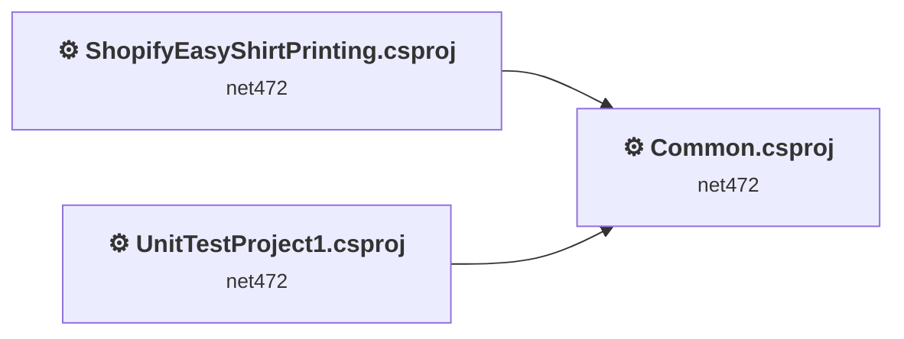
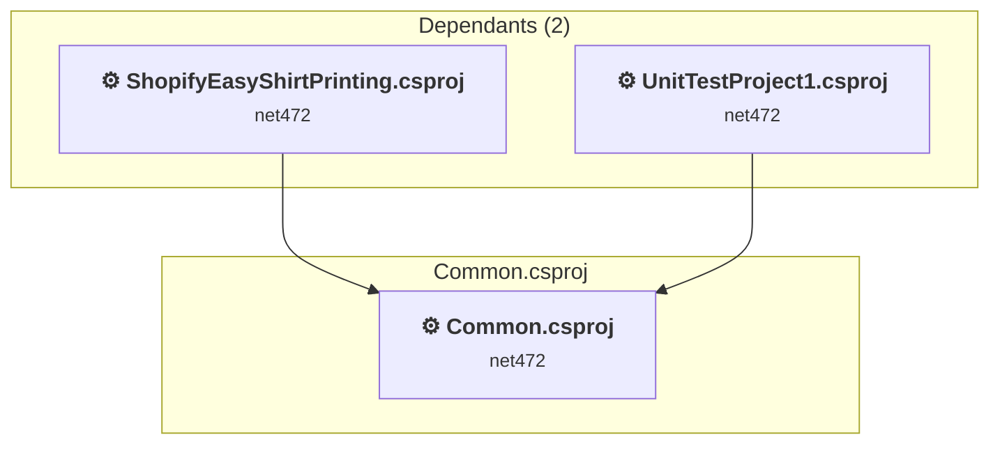
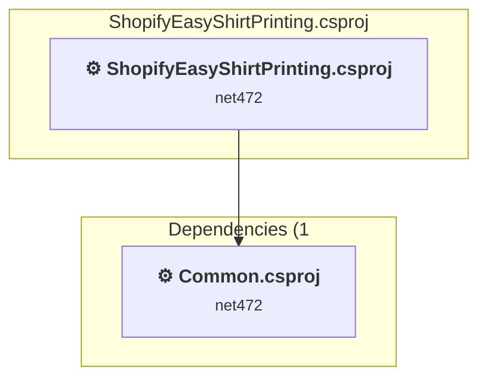
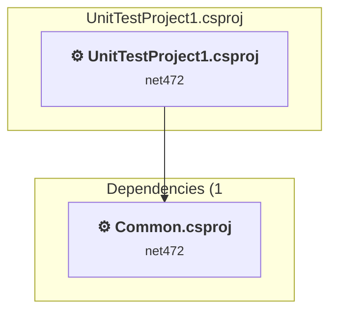

# Projects and dependencies analysis

This document provides a comprehensive overview of the projects and their dependencies in the context of upgrading to .NETCoreApp,Version=v10.0.

## Table of Contents

- [Executive Summary](#executive-Summary)
  - [Highlevel Metrics](#highlevel-metrics)
  - [Projects Compatibility](#projects-compatibility)
  - [Package Compatibility](#package-compatibility)
  - [API Compatibility](#api-compatibility)
- [Aggregate NuGet packages details](#aggregate-nuget-packages-details)
- [Top API Migration Challenges](#top-api-migration-challenges)
  - [Technologies and Features](#technologies-and-features)
  - [Most Frequent API Issues](#most-frequent-api-issues)
- [Projects Relationship Graph](#projects-relationship-graph)
- [Project Details](#project-details)

  - [Common\Common.csproj](#commoncommoncsproj)
  - [ShopifyAutoShirtPrinting\ShopifyEasyShirtPrinting.csproj](#shopifyautoshirtprintingshopifyeasyshirtprintingcsproj)
  - [UnitTestProject1\UnitTestProject1.csproj](#unittestproject1unittestproject1csproj)

## Executive Summary

### Highlevel Metrics

| Metric | Count | Status |
| :--- | :---: | :--- |
| Total Projects | 3 | All require upgrade |
| Total NuGet Packages | 153 | 70 need upgrade |
| Total Code Files | 139 |  |
| Total Code Files with Incidents | 95 |  |
| Total Lines of Code | 13485 |  |
| Total Number of Issues | 1837 |  |
| Estimated LOC to modify | 1689+ | at least 12.5% of codebase |

### Projects Compatibility

| Project | Target Framework | Difficulty | Package Issues | API Issues | Est. LOC Impact | Description |
| :--- | :---: | :---: | :---: | :---: | :---: | :--- |
| [Common\Common.csproj](#commoncommoncsproj) | net472 | 🟢 Low | 11 | 15 | 15+ | ClassicClassLibrary, Sdk Style = False |
| [ShopifyAutoShirtPrinting\ShopifyEasyShirtPrinting.csproj](#shopifyautoshirtprintingshopifyeasyshirtprintingcsproj) | net472 | 🟡 Medium | 122 | 1674 | 1674+ | ClassicWpf, Sdk Style = False |
| [UnitTestProject1\UnitTestProject1.csproj](#unittestproject1unittestproject1csproj) | net472 | 🟢 Low | 9 | 0 |  | ClassicClassLibrary, Sdk Style = False |

### Package Compatibility

| Status | Count | Percentage |
| :--- | :---: | :---: |
| ✅ Compatible | 83 | 54.2% |
| ⚠️ Incompatible | 48 | 31.4% |
| 🔄 Upgrade Recommended | 22 | 14.4% |
| ***Total NuGet Packages*** | ***153*** | ***100%*** |

### API Compatibility

| Category | Count | Impact |
| :--- | :---: | :--- |
| 🔴 Binary Incompatible | 1269 | High - Require code changes |
| 🟡 Source Incompatible | 314 | Medium - Needs re-compilation and potential conflicting API error fixing |
| 🔵 Behavioral change | 106 | Low - Behavioral changes that may require testing at runtime |
| ✅ Compatible | 13660 |  |
| ***Total APIs Analyzed*** | ***15349*** |  |

## Aggregate NuGet packages details

| Package | Current Version | Suggested Version | Projects | Description |
| :--- | :---: | :---: | :--- | :--- |
| AngleSharp | 1.4.0 |  | [ShopifyEasyShirtPrinting.csproj](#shopifyautoshirtprintingshopifyeasyshirtprintingcsproj) | ✅Compatible |
| AutoMapper | 10.1.1 | 16.1.1 | [ShopifyEasyShirtPrinting.csproj](#shopifyautoshirtprintingshopifyeasyshirtprintingcsproj) | NuGet package contains security vulnerability |
| ControlzEx | 4.4.0 |  | [ShopifyEasyShirtPrinting.csproj](#shopifyautoshirtprintingshopifyeasyshirtprintingcsproj) | ✅Compatible |
| CuttingEdge.Conditions | 1.2.0.0 |  | [ShopifyEasyShirtPrinting.csproj](#shopifyautoshirtprintingshopifyeasyshirtprintingcsproj) | ⚠️NuGet package is incompatible |
| DeviceId | 6.9.0 |  | [ShopifyEasyShirtPrinting.csproj](#shopifyautoshirtprintingshopifyeasyshirtprintingcsproj) | ✅Compatible |
| DeviceId.Windows | 6.9.0 |  | [ShopifyEasyShirtPrinting.csproj](#shopifyautoshirtprintingshopifyeasyshirtprintingcsproj) | ✅Compatible |
| DotNetEnv | 3.1.1 |  | [ShopifyEasyShirtPrinting.csproj](#shopifyautoshirtprintingshopifyeasyshirtprintingcsproj) | ✅Compatible |
| DryIoc.dll | 4.7.7 |  | [ShopifyEasyShirtPrinting.csproj](#shopifyautoshirtprintingshopifyeasyshirtprintingcsproj) | ✅Compatible |
| EPPlus | 7.5.3 |  | [ShopifyEasyShirtPrinting.csproj](#shopifyautoshirtprintingshopifyeasyshirtprintingcsproj) | ✅Compatible |
| EPPlus.Interfaces | 7.5.0 |  | [ShopifyEasyShirtPrinting.csproj](#shopifyautoshirtprintingshopifyeasyshirtprintingcsproj) | ✅Compatible |
| EPPlus.System.Drawing | 7.5.0 |  | [ShopifyEasyShirtPrinting.csproj](#shopifyautoshirtprintingshopifyeasyshirtprintingcsproj) | ✅Compatible |
| LiteDB | 5.0.21 |  | [ShopifyEasyShirtPrinting.csproj](#shopifyautoshirtprintingshopifyeasyshirtprintingcsproj) | ✅Compatible |
| Magick.NET.Core | 14.13.0 |  | [ShopifyEasyShirtPrinting.csproj](#shopifyautoshirtprintingshopifyeasyshirtprintingcsproj) | ✅Compatible |
| Magick.NET-Q16-AnyCPU | 14.13.0 | 14.14.0 | [ShopifyEasyShirtPrinting.csproj](#shopifyautoshirtprintingshopifyeasyshirtprintingcsproj) | NuGet package contains security vulnerability |
| MahApps.Metro | 2.4.11 |  | [ShopifyEasyShirtPrinting.csproj](#shopifyautoshirtprintingshopifyeasyshirtprintingcsproj) | ✅Compatible |
| MahApps.Metro.IconPacks | 6.2.1 | 4.11.0 | [ShopifyEasyShirtPrinting.csproj](#shopifyautoshirtprintingshopifyeasyshirtprintingcsproj) | ⚠️NuGet package is incompatible |
| MahApps.Metro.IconPacks.BootstrapIcons | 6.2.1 | 4.11.0 | [ShopifyEasyShirtPrinting.csproj](#shopifyautoshirtprintingshopifyeasyshirtprintingcsproj) | ⚠️NuGet package is incompatible |
| MahApps.Metro.IconPacks.BoxIcons | 6.2.1 | 4.11.0 | [ShopifyEasyShirtPrinting.csproj](#shopifyautoshirtprintingshopifyeasyshirtprintingcsproj) | ⚠️NuGet package is incompatible |
| MahApps.Metro.IconPacks.BoxIcons2 | 6.2.1 |  | [ShopifyEasyShirtPrinting.csproj](#shopifyautoshirtprintingshopifyeasyshirtprintingcsproj) | ⚠️NuGet package is incompatible |
| MahApps.Metro.IconPacks.CircumIcons | 6.2.1 |  | [ShopifyEasyShirtPrinting.csproj](#shopifyautoshirtprintingshopifyeasyshirtprintingcsproj) | ⚠️NuGet package is incompatible |
| MahApps.Metro.IconPacks.Codicons | 6.2.1 | 4.11.0 | [ShopifyEasyShirtPrinting.csproj](#shopifyautoshirtprintingshopifyeasyshirtprintingcsproj) | ⚠️NuGet package is incompatible |
| MahApps.Metro.IconPacks.Coolicons | 6.2.1 | 4.11.0 | [ShopifyEasyShirtPrinting.csproj](#shopifyautoshirtprintingshopifyeasyshirtprintingcsproj) | ⚠️NuGet package is incompatible |
| MahApps.Metro.IconPacks.Core | 6.2.1 |  | [ShopifyEasyShirtPrinting.csproj](#shopifyautoshirtprintingshopifyeasyshirtprintingcsproj) | ⚠️NuGet package is incompatible |
| MahApps.Metro.IconPacks.Entypo | 6.2.1 | 4.11.0 | [ShopifyEasyShirtPrinting.csproj](#shopifyautoshirtprintingshopifyeasyshirtprintingcsproj) | ⚠️NuGet package is incompatible |
| MahApps.Metro.IconPacks.EvaIcons | 6.2.1 | 4.11.0 | [ShopifyEasyShirtPrinting.csproj](#shopifyautoshirtprintingshopifyeasyshirtprintingcsproj) | ⚠️NuGet package is incompatible |
| MahApps.Metro.IconPacks.FeatherIcons | 6.2.1 | 4.11.0 | [ShopifyEasyShirtPrinting.csproj](#shopifyautoshirtprintingshopifyeasyshirtprintingcsproj) | ⚠️NuGet package is incompatible |
| MahApps.Metro.IconPacks.FileIcons | 6.2.1 | 4.11.0 | [ShopifyEasyShirtPrinting.csproj](#shopifyautoshirtprintingshopifyeasyshirtprintingcsproj) | ⚠️NuGet package is incompatible |
| MahApps.Metro.IconPacks.Fontaudio | 6.2.1 | 4.11.0 | [ShopifyEasyShirtPrinting.csproj](#shopifyautoshirtprintingshopifyeasyshirtprintingcsproj) | ⚠️NuGet package is incompatible |
| MahApps.Metro.IconPacks.FontAwesome | 6.2.1 | 4.11.0 | [ShopifyEasyShirtPrinting.csproj](#shopifyautoshirtprintingshopifyeasyshirtprintingcsproj) | ⚠️NuGet package is incompatible |
| MahApps.Metro.IconPacks.FontAwesome5 | 6.2.1 |  | [ShopifyEasyShirtPrinting.csproj](#shopifyautoshirtprintingshopifyeasyshirtprintingcsproj) | ⚠️NuGet package is incompatible |
| MahApps.Metro.IconPacks.FontAwesome6 | 6.2.1 |  | [ShopifyEasyShirtPrinting.csproj](#shopifyautoshirtprintingshopifyeasyshirtprintingcsproj) | ⚠️NuGet package is incompatible |
| MahApps.Metro.IconPacks.Fontisto | 6.2.1 | 4.11.0 | [ShopifyEasyShirtPrinting.csproj](#shopifyautoshirtprintingshopifyeasyshirtprintingcsproj) | ⚠️NuGet package is incompatible |
| MahApps.Metro.IconPacks.ForkAwesome | 6.2.1 | 4.11.0 | [ShopifyEasyShirtPrinting.csproj](#shopifyautoshirtprintingshopifyeasyshirtprintingcsproj) | ⚠️NuGet package is incompatible |
| MahApps.Metro.IconPacks.GameIcons | 6.2.1 |  | [ShopifyEasyShirtPrinting.csproj](#shopifyautoshirtprintingshopifyeasyshirtprintingcsproj) | ⚠️NuGet package is incompatible |
| MahApps.Metro.IconPacks.Ionicons | 6.2.1 | 4.11.0 | [ShopifyEasyShirtPrinting.csproj](#shopifyautoshirtprintingshopifyeasyshirtprintingcsproj) | ⚠️NuGet package is incompatible |
| MahApps.Metro.IconPacks.JamIcons | 6.2.1 | 4.11.0 | [ShopifyEasyShirtPrinting.csproj](#shopifyautoshirtprintingshopifyeasyshirtprintingcsproj) | ⚠️NuGet package is incompatible |
| MahApps.Metro.IconPacks.KeyruneIcons | 6.2.1 |  | [ShopifyEasyShirtPrinting.csproj](#shopifyautoshirtprintingshopifyeasyshirtprintingcsproj) | ⚠️NuGet package is incompatible |
| MahApps.Metro.IconPacks.Lucide | 6.2.1 |  | [ShopifyEasyShirtPrinting.csproj](#shopifyautoshirtprintingshopifyeasyshirtprintingcsproj) | ⚠️NuGet package is incompatible |
| MahApps.Metro.IconPacks.Material | 6.2.1 | 4.11.0 | [ShopifyEasyShirtPrinting.csproj](#shopifyautoshirtprintingshopifyeasyshirtprintingcsproj) | ⚠️NuGet package is incompatible |
| MahApps.Metro.IconPacks.MaterialDesign | 6.2.1 | 4.11.0 | [ShopifyEasyShirtPrinting.csproj](#shopifyautoshirtprintingshopifyeasyshirtprintingcsproj) | ⚠️NuGet package is incompatible |
| MahApps.Metro.IconPacks.MaterialLight | 6.2.1 | 4.11.0 | [ShopifyEasyShirtPrinting.csproj](#shopifyautoshirtprintingshopifyeasyshirtprintingcsproj) | ⚠️NuGet package is incompatible |
| MahApps.Metro.IconPacks.MemoryIcons | 6.2.1 |  | [ShopifyEasyShirtPrinting.csproj](#shopifyautoshirtprintingshopifyeasyshirtprintingcsproj) | ⚠️NuGet package is incompatible |
| MahApps.Metro.IconPacks.Microns | 6.2.1 | 4.11.0 | [ShopifyEasyShirtPrinting.csproj](#shopifyautoshirtprintingshopifyeasyshirtprintingcsproj) | ⚠️NuGet package is incompatible |
| MahApps.Metro.IconPacks.MingCuteIcons | 6.2.1 |  | [ShopifyEasyShirtPrinting.csproj](#shopifyautoshirtprintingshopifyeasyshirtprintingcsproj) | ⚠️NuGet package is incompatible |
| MahApps.Metro.IconPacks.Modern | 6.2.1 | 4.11.0 | [ShopifyEasyShirtPrinting.csproj](#shopifyautoshirtprintingshopifyeasyshirtprintingcsproj) | ⚠️NuGet package is incompatible |
| MahApps.Metro.IconPacks.MynaUIIcons | 6.2.1 |  | [ShopifyEasyShirtPrinting.csproj](#shopifyautoshirtprintingshopifyeasyshirtprintingcsproj) | ⚠️NuGet package is incompatible |
| MahApps.Metro.IconPacks.Octicons | 6.2.1 | 4.11.0 | [ShopifyEasyShirtPrinting.csproj](#shopifyautoshirtprintingshopifyeasyshirtprintingcsproj) | ⚠️NuGet package is incompatible |
| MahApps.Metro.IconPacks.PhosphorIcons | 6.2.1 |  | [ShopifyEasyShirtPrinting.csproj](#shopifyautoshirtprintingshopifyeasyshirtprintingcsproj) | ⚠️NuGet package is incompatible |
| MahApps.Metro.IconPacks.PicolIcons | 6.2.1 | 4.11.0 | [ShopifyEasyShirtPrinting.csproj](#shopifyautoshirtprintingshopifyeasyshirtprintingcsproj) | ⚠️NuGet package is incompatible |
| MahApps.Metro.IconPacks.PixelartIcons | 6.2.1 | 4.11.0 | [ShopifyEasyShirtPrinting.csproj](#shopifyautoshirtprintingshopifyeasyshirtprintingcsproj) | ⚠️NuGet package is incompatible |
| MahApps.Metro.IconPacks.RadixIcons | 6.2.1 | 4.11.0 | [ShopifyEasyShirtPrinting.csproj](#shopifyautoshirtprintingshopifyeasyshirtprintingcsproj) | ⚠️NuGet package is incompatible |
| MahApps.Metro.IconPacks.RemixIcon | 6.2.1 | 4.11.0 | [ShopifyEasyShirtPrinting.csproj](#shopifyautoshirtprintingshopifyeasyshirtprintingcsproj) | ⚠️NuGet package is incompatible |
| MahApps.Metro.IconPacks.RPGAwesome | 6.2.1 | 4.11.0 | [ShopifyEasyShirtPrinting.csproj](#shopifyautoshirtprintingshopifyeasyshirtprintingcsproj) | ⚠️NuGet package is incompatible |
| MahApps.Metro.IconPacks.SimpleIcons | 6.2.1 | 4.11.0 | [ShopifyEasyShirtPrinting.csproj](#shopifyautoshirtprintingshopifyeasyshirtprintingcsproj) | ⚠️NuGet package is incompatible |
| MahApps.Metro.IconPacks.Typicons | 6.2.1 | 4.11.0 | [ShopifyEasyShirtPrinting.csproj](#shopifyautoshirtprintingshopifyeasyshirtprintingcsproj) | ⚠️NuGet package is incompatible |
| MahApps.Metro.IconPacks.Unicons | 6.2.1 | 4.11.0 | [ShopifyEasyShirtPrinting.csproj](#shopifyautoshirtprintingshopifyeasyshirtprintingcsproj) | ⚠️NuGet package is incompatible |
| MahApps.Metro.IconPacks.VaadinIcons | 6.2.1 | 4.11.0 | [ShopifyEasyShirtPrinting.csproj](#shopifyautoshirtprintingshopifyeasyshirtprintingcsproj) | ⚠️NuGet package is incompatible |
| MahApps.Metro.IconPacks.WeatherIcons | 6.2.1 | 4.11.0 | [ShopifyEasyShirtPrinting.csproj](#shopifyautoshirtprintingshopifyeasyshirtprintingcsproj) | ⚠️NuGet package is incompatible |
| MahApps.Metro.IconPacks.Zondicons | 6.2.1 | 4.11.0 | [ShopifyEasyShirtPrinting.csproj](#shopifyautoshirtprintingshopifyeasyshirtprintingcsproj) | ⚠️NuGet package is incompatible |
| Microsoft.Bcl.AsyncInterfaces | 8.0.0 | 10.0.9 | [Common.csproj](#commoncommoncsproj) [ShopifyEasyShirtPrinting.csproj](#shopifyautoshirtprintingshopifyeasyshirtprintingcsproj) [UnitTestProject1.csproj](#unittestproject1unittestproject1csproj) | NuGet package upgrade is recommended |
| Microsoft.Bcl.HashCode | 1.1.1 | 6.0.0 | [Common.csproj](#commoncommoncsproj) [ShopifyEasyShirtPrinting.csproj](#shopifyautoshirtprintingshopifyeasyshirtprintingcsproj) | NuGet package upgrade is recommended |
| Microsoft.Extensions.Configuration | 2.1.0 | 10.0.9 | [ShopifyEasyShirtPrinting.csproj](#shopifyautoshirtprintingshopifyeasyshirtprintingcsproj) | NuGet package upgrade is recommended |
| Microsoft.Extensions.Configuration.Abstractions | 2.1.0 | 10.0.9 | [ShopifyEasyShirtPrinting.csproj](#shopifyautoshirtprintingshopifyeasyshirtprintingcsproj) | NuGet package upgrade is recommended |
| Microsoft.Extensions.Configuration.Binder | 2.1.0 | 10.0.9 | [ShopifyEasyShirtPrinting.csproj](#shopifyautoshirtprintingshopifyeasyshirtprintingcsproj) | NuGet package upgrade is recommended |
| Microsoft.Extensions.DependencyInjection.Abstractions | 2.1.0 | 10.0.9 | [ShopifyEasyShirtPrinting.csproj](#shopifyautoshirtprintingshopifyeasyshirtprintingcsproj) | NuGet package upgrade is recommended |
| Microsoft.Extensions.Http | 2.1.0 | 10.0.9 | [ShopifyEasyShirtPrinting.csproj](#shopifyautoshirtprintingshopifyeasyshirtprintingcsproj) | NuGet package upgrade is recommended |
| Microsoft.Extensions.Logging | 2.1.0 | 10.0.9 | [ShopifyEasyShirtPrinting.csproj](#shopifyautoshirtprintingshopifyeasyshirtprintingcsproj) | NuGet package upgrade is recommended |
| Microsoft.Extensions.Logging.Abstractions | 6.0.0 | 10.0.9 | [ShopifyEasyShirtPrinting.csproj](#shopifyautoshirtprintingshopifyeasyshirtprintingcsproj) | NuGet package upgrade is recommended |
| Microsoft.Extensions.Options | 2.1.0 | 10.0.9 | [ShopifyEasyShirtPrinting.csproj](#shopifyautoshirtprintingshopifyeasyshirtprintingcsproj) | NuGet package upgrade is recommended |
| Microsoft.Extensions.Primitives | 7.0.0 | 10.0.9 | [ShopifyEasyShirtPrinting.csproj](#shopifyautoshirtprintingshopifyeasyshirtprintingcsproj) | NuGet package upgrade is recommended |
| Microsoft.IO.RecyclableMemoryStream | 3.0.1 |  | [ShopifyEasyShirtPrinting.csproj](#shopifyautoshirtprintingshopifyeasyshirtprintingcsproj) | ✅Compatible |
| Microsoft.NETCore.Platforms | 7.0.0 |  | [ShopifyEasyShirtPrinting.csproj](#shopifyautoshirtprintingshopifyeasyshirtprintingcsproj) | NuGet package functionality is included with framework reference |
| Microsoft.Win32.Primitives | 4.3.0 |  | [ShopifyEasyShirtPrinting.csproj](#shopifyautoshirtprintingshopifyeasyshirtprintingcsproj) | NuGet package functionality is included with framework reference |
| Microsoft.Win32.Registry | 5.0.0 |  | [ShopifyEasyShirtPrinting.csproj](#shopifyautoshirtprintingshopifyeasyshirtprintingcsproj) | NuGet package functionality is included with framework reference |
| Microsoft.Xaml.Behaviors.Wpf | 1.1.31 |  | [ShopifyEasyShirtPrinting.csproj](#shopifyautoshirtprintingshopifyeasyshirtprintingcsproj) | ✅Compatible |
| MSTest.TestAdapter | 2.2.10 |  | [UnitTestProject1.csproj](#unittestproject1unittestproject1csproj) | ✅Compatible |
| MSTest.TestFramework | 2.2.10 |  | [UnitTestProject1.csproj](#unittestproject1unittestproject1csproj) | ✅Compatible |
| Netco | 1.5.1 | 3.0.0 | [ShopifyEasyShirtPrinting.csproj](#shopifyautoshirtprintingshopifyeasyshirtprintingcsproj) | ⚠️NuGet package is incompatible |
| NETStandard.Library | 1.6.1 |  | [ShopifyEasyShirtPrinting.csproj](#shopifyautoshirtprintingshopifyeasyshirtprintingcsproj) | NuGet package functionality is included with framework reference |
| Newtonsoft.Json | 13.0.4 |  | [Common.csproj](#commoncommoncsproj) [ShopifyEasyShirtPrinting.csproj](#shopifyautoshirtprintingshopifyeasyshirtprintingcsproj) | ✅Compatible |
| NLog | 5.1.3 |  | [Common.csproj](#commoncommoncsproj) [ShopifyEasyShirtPrinting.csproj](#shopifyautoshirtprintingshopifyeasyshirtprintingcsproj) | ✅Compatible |
| PdfiumViewer | 2.13.0.0 |  | [Common.csproj](#commoncommoncsproj) [ShopifyEasyShirtPrinting.csproj](#shopifyautoshirtprintingshopifyeasyshirtprintingcsproj) | ⚠️NuGet package is incompatible |
| PdfiumViewer.Native.x86_64.v8-xfa | 2018.4.8.256 |  | [Common.csproj](#commoncommoncsproj) [ShopifyEasyShirtPrinting.csproj](#shopifyautoshirtprintingshopifyeasyshirtprintingcsproj) | ✅Compatible |
| Prism.Core | 8.1.97 |  | [ShopifyEasyShirtPrinting.csproj](#shopifyautoshirtprintingshopifyeasyshirtprintingcsproj) | ✅Compatible |
| Prism.DryIoc | 8.1.97 |  | [ShopifyEasyShirtPrinting.csproj](#shopifyautoshirtprintingshopifyeasyshirtprintingcsproj) | ✅Compatible |
| Prism.Wpf | 8.1.97 |  | [ShopifyEasyShirtPrinting.csproj](#shopifyautoshirtprintingshopifyeasyshirtprintingcsproj) | ✅Compatible |
| RabbitMQ.Client | 6.5.0 |  | [ShopifyEasyShirtPrinting.csproj](#shopifyautoshirtprintingshopifyeasyshirtprintingcsproj) | ✅Compatible |
| RestSharp | 112.1.0 |  | [Common.csproj](#commoncommoncsproj) [ShopifyEasyShirtPrinting.csproj](#shopifyautoshirtprintingshopifyeasyshirtprintingcsproj) | ✅Compatible |
| RestSharp.Serializers.NewtonsoftJson | 112.1.0 |  | [Common.csproj](#commoncommoncsproj) [ShopifyEasyShirtPrinting.csproj](#shopifyautoshirtprintingshopifyeasyshirtprintingcsproj) | ✅Compatible |
| ServiceStack.Text | 4.0.42 | 10.0.8 | [ShopifyEasyShirtPrinting.csproj](#shopifyautoshirtprintingshopifyeasyshirtprintingcsproj) | ⚠️NuGet package is incompatible |
| SharpZipLib | 1.4.2 |  | [ShopifyEasyShirtPrinting.csproj](#shopifyautoshirtprintingshopifyeasyshirtprintingcsproj) | ✅Compatible |
| Sprache | 2.3.1 |  | [ShopifyEasyShirtPrinting.csproj](#shopifyautoshirtprintingshopifyeasyshirtprintingcsproj) | ✅Compatible |
| System.AppContext | 4.3.0 |  | [ShopifyEasyShirtPrinting.csproj](#shopifyautoshirtprintingshopifyeasyshirtprintingcsproj) | NuGet package functionality is included with framework reference |
| System.Buffers | 4.5.1 |  | [Common.csproj](#commoncommoncsproj) [ShopifyEasyShirtPrinting.csproj](#shopifyautoshirtprintingshopifyeasyshirtprintingcsproj) [UnitTestProject1.csproj](#unittestproject1unittestproject1csproj) | NuGet package functionality is included with framework reference |
| System.Collections | 4.3.0 |  | [ShopifyEasyShirtPrinting.csproj](#shopifyautoshirtprintingshopifyeasyshirtprintingcsproj) | NuGet package functionality is included with framework reference |
| System.Collections.Concurrent | 4.3.0 |  | [ShopifyEasyShirtPrinting.csproj](#shopifyautoshirtprintingshopifyeasyshirtprintingcsproj) | NuGet package functionality is included with framework reference |
| System.Collections.Immutable | 7.0.0 | 10.0.9 | [ShopifyEasyShirtPrinting.csproj](#shopifyautoshirtprintingshopifyeasyshirtprintingcsproj) | NuGet package upgrade is recommended |
| System.ComponentModel.Annotations | 5.0.0 |  | [ShopifyEasyShirtPrinting.csproj](#shopifyautoshirtprintingshopifyeasyshirtprintingcsproj) | NuGet package functionality is included with framework reference |
| System.Console | 4.3.0 |  | [ShopifyEasyShirtPrinting.csproj](#shopifyautoshirtprintingshopifyeasyshirtprintingcsproj) | NuGet package functionality is included with framework reference |
| System.Diagnostics.Debug | 4.3.0 |  | [ShopifyEasyShirtPrinting.csproj](#shopifyautoshirtprintingshopifyeasyshirtprintingcsproj) | NuGet package functionality is included with framework reference |
| System.Diagnostics.DiagnosticSource | 6.0.0 | 10.0.9 | [ShopifyEasyShirtPrinting.csproj](#shopifyautoshirtprintingshopifyeasyshirtprintingcsproj) | NuGet package upgrade is recommended |
| System.Diagnostics.Tools | 4.3.0 |  | [ShopifyEasyShirtPrinting.csproj](#shopifyautoshirtprintingshopifyeasyshirtprintingcsproj) | NuGet package functionality is included with framework reference |
| System.Diagnostics.Tracing | 4.3.0 |  | [ShopifyEasyShirtPrinting.csproj](#shopifyautoshirtprintingshopifyeasyshirtprintingcsproj) | NuGet package functionality is included with framework reference |
| System.Drawing.Common | 8.0.4 | 10.0.9 | [ShopifyEasyShirtPrinting.csproj](#shopifyautoshirtprintingshopifyeasyshirtprintingcsproj) | NuGet package upgrade is recommended |
| System.Globalization | 4.3.0 |  | [ShopifyEasyShirtPrinting.csproj](#shopifyautoshirtprintingshopifyeasyshirtprintingcsproj) | NuGet package functionality is included with framework reference |
| System.Globalization.Calendars | 4.3.0 |  | [ShopifyEasyShirtPrinting.csproj](#shopifyautoshirtprintingshopifyeasyshirtprintingcsproj) | NuGet package functionality is included with framework reference |
| System.IO | 4.3.0 |  | [ShopifyEasyShirtPrinting.csproj](#shopifyautoshirtprintingshopifyeasyshirtprintingcsproj) | NuGet package functionality is included with framework reference |
| System.IO.Compression | 4.3.0 |  | [ShopifyEasyShirtPrinting.csproj](#shopifyautoshirtprintingshopifyeasyshirtprintingcsproj) | NuGet package functionality is included with framework reference |
| System.IO.Compression.ZipFile | 4.3.0 |  | [ShopifyEasyShirtPrinting.csproj](#shopifyautoshirtprintingshopifyeasyshirtprintingcsproj) | NuGet package functionality is included with framework reference |
| System.IO.FileSystem | 4.3.0 |  | [ShopifyEasyShirtPrinting.csproj](#shopifyautoshirtprintingshopifyeasyshirtprintingcsproj) | NuGet package functionality is included with framework reference |
| System.IO.FileSystem.Primitives | 4.3.0 |  | [ShopifyEasyShirtPrinting.csproj](#shopifyautoshirtprintingshopifyeasyshirtprintingcsproj) | NuGet package functionality is included with framework reference |
| System.Linq | 4.3.0 |  | [ShopifyEasyShirtPrinting.csproj](#shopifyautoshirtprintingshopifyeasyshirtprintingcsproj) | NuGet package functionality is included with framework reference |
| System.Linq.Expressions | 4.3.0 |  | [ShopifyEasyShirtPrinting.csproj](#shopifyautoshirtprintingshopifyeasyshirtprintingcsproj) | NuGet package functionality is included with framework reference |
| System.Memory | 4.5.5 |  | [Common.csproj](#commoncommoncsproj) [ShopifyEasyShirtPrinting.csproj](#shopifyautoshirtprintingshopifyeasyshirtprintingcsproj) [UnitTestProject1.csproj](#unittestproject1unittestproject1csproj) | NuGet package functionality is included with framework reference |
| System.Net.Http | 4.3.4 |  | [ShopifyEasyShirtPrinting.csproj](#shopifyautoshirtprintingshopifyeasyshirtprintingcsproj) | NuGet package functionality is included with framework reference |
| System.Net.Primitives | 4.3.0 |  | [ShopifyEasyShirtPrinting.csproj](#shopifyautoshirtprintingshopifyeasyshirtprintingcsproj) | NuGet package functionality is included with framework reference |
| System.Net.Sockets | 4.3.0 |  | [ShopifyEasyShirtPrinting.csproj](#shopifyautoshirtprintingshopifyeasyshirtprintingcsproj) | NuGet package functionality is included with framework reference |
| System.Numerics.Vectors | 4.5.0 |  | [Common.csproj](#commoncommoncsproj) [ShopifyEasyShirtPrinting.csproj](#shopifyautoshirtprintingshopifyeasyshirtprintingcsproj) [UnitTestProject1.csproj](#unittestproject1unittestproject1csproj) | NuGet package functionality is included with framework reference |
| System.ObjectModel | 4.3.0 |  | [ShopifyEasyShirtPrinting.csproj](#shopifyautoshirtprintingshopifyeasyshirtprintingcsproj) | NuGet package functionality is included with framework reference |
| System.Reflection | 4.3.0 |  | [ShopifyEasyShirtPrinting.csproj](#shopifyautoshirtprintingshopifyeasyshirtprintingcsproj) | NuGet package functionality is included with framework reference |
| System.Reflection.Extensions | 4.3.0 |  | [ShopifyEasyShirtPrinting.csproj](#shopifyautoshirtprintingshopifyeasyshirtprintingcsproj) | NuGet package functionality is included with framework reference |
| System.Reflection.Primitives | 4.3.0 |  | [ShopifyEasyShirtPrinting.csproj](#shopifyautoshirtprintingshopifyeasyshirtprintingcsproj) | NuGet package functionality is included with framework reference |
| System.Resources.ResourceManager | 4.3.0 |  | [ShopifyEasyShirtPrinting.csproj](#shopifyautoshirtprintingshopifyeasyshirtprintingcsproj) | NuGet package functionality is included with framework reference |
| System.Runtime | 4.3.0 |  | [ShopifyEasyShirtPrinting.csproj](#shopifyautoshirtprintingshopifyeasyshirtprintingcsproj) | NuGet package functionality is included with framework reference |
| System.Runtime.CompilerServices.Unsafe | 6.0.0 | 6.1.2 | [Common.csproj](#commoncommoncsproj) [ShopifyEasyShirtPrinting.csproj](#shopifyautoshirtprintingshopifyeasyshirtprintingcsproj) [UnitTestProject1.csproj](#unittestproject1unittestproject1csproj) | NuGet package upgrade is recommended |
| System.Runtime.Extensions | 4.3.0 |  | [ShopifyEasyShirtPrinting.csproj](#shopifyautoshirtprintingshopifyeasyshirtprintingcsproj) | NuGet package functionality is included with framework reference |
| System.Runtime.Handles | 4.3.0 |  | [ShopifyEasyShirtPrinting.csproj](#shopifyautoshirtprintingshopifyeasyshirtprintingcsproj) | ✅Compatible |
| System.Runtime.InteropServices | 4.3.0 |  | [ShopifyEasyShirtPrinting.csproj](#shopifyautoshirtprintingshopifyeasyshirtprintingcsproj) | NuGet package functionality is included with framework reference |
| System.Runtime.InteropServices.RuntimeInformation | 4.3.0 |  | [ShopifyEasyShirtPrinting.csproj](#shopifyautoshirtprintingshopifyeasyshirtprintingcsproj) | NuGet package functionality is included with framework reference |
| System.Runtime.Numerics | 4.3.0 |  | [ShopifyEasyShirtPrinting.csproj](#shopifyautoshirtprintingshopifyeasyshirtprintingcsproj) | NuGet package functionality is included with framework reference |
| System.Security.AccessControl | 6.0.0 | 6.0.1 | [ShopifyEasyShirtPrinting.csproj](#shopifyautoshirtprintingshopifyeasyshirtprintingcsproj) | NuGet package upgrade is recommended |
| System.Security.Cryptography.Algorithms | 4.3.0 |  | [ShopifyEasyShirtPrinting.csproj](#shopifyautoshirtprintingshopifyeasyshirtprintingcsproj) | NuGet package functionality is included with framework reference |
| System.Security.Cryptography.Encoding | 4.3.0 |  | [ShopifyEasyShirtPrinting.csproj](#shopifyautoshirtprintingshopifyeasyshirtprintingcsproj) | NuGet package functionality is included with framework reference |
| System.Security.Cryptography.Primitives | 4.3.0 |  | [ShopifyEasyShirtPrinting.csproj](#shopifyautoshirtprintingshopifyeasyshirtprintingcsproj) | NuGet package functionality is included with framework reference |
| System.Security.Cryptography.X509Certificates | 4.3.0 |  | [ShopifyEasyShirtPrinting.csproj](#shopifyautoshirtprintingshopifyeasyshirtprintingcsproj) | NuGet package functionality is included with framework reference |
| System.Security.Principal.Windows | 5.0.0 |  | [ShopifyEasyShirtPrinting.csproj](#shopifyautoshirtprintingshopifyeasyshirtprintingcsproj) | NuGet package functionality is included with framework reference |
| System.Text.Encoding | 4.3.0 |  | [ShopifyEasyShirtPrinting.csproj](#shopifyautoshirtprintingshopifyeasyshirtprintingcsproj) | NuGet package functionality is included with framework reference |
| System.Text.Encoding.CodePages | 8.0.0 | 10.0.9 | [ShopifyEasyShirtPrinting.csproj](#shopifyautoshirtprintingshopifyeasyshirtprintingcsproj) | NuGet package upgrade is recommended |
| System.Text.Encoding.Extensions | 4.3.0 |  | [ShopifyEasyShirtPrinting.csproj](#shopifyautoshirtprintingshopifyeasyshirtprintingcsproj) | NuGet package functionality is included with framework reference |
| System.Text.Encodings.Web | 8.0.0 | 10.0.9 | [Common.csproj](#commoncommoncsproj) [ShopifyEasyShirtPrinting.csproj](#shopifyautoshirtprintingshopifyeasyshirtprintingcsproj) [UnitTestProject1.csproj](#unittestproject1unittestproject1csproj) | NuGet package upgrade is recommended |
| System.Text.Json | 8.0.5 | 10.0.9 | [Common.csproj](#commoncommoncsproj) [ShopifyEasyShirtPrinting.csproj](#shopifyautoshirtprintingshopifyeasyshirtprintingcsproj) [UnitTestProject1.csproj](#unittestproject1unittestproject1csproj) | NuGet package upgrade is recommended |
| System.Text.RegularExpressions | 4.3.1 |  | [ShopifyEasyShirtPrinting.csproj](#shopifyautoshirtprintingshopifyeasyshirtprintingcsproj) | NuGet package functionality is included with framework reference |
| System.Threading | 4.3.0 |  | [ShopifyEasyShirtPrinting.csproj](#shopifyautoshirtprintingshopifyeasyshirtprintingcsproj) | NuGet package functionality is included with framework reference |
| System.Threading.Channels | 7.0.0 | 10.0.9 | [ShopifyEasyShirtPrinting.csproj](#shopifyautoshirtprintingshopifyeasyshirtprintingcsproj) | NuGet package upgrade is recommended |
| System.Threading.Tasks | 4.3.0 |  | [ShopifyEasyShirtPrinting.csproj](#shopifyautoshirtprintingshopifyeasyshirtprintingcsproj) | NuGet package functionality is included with framework reference |
| System.Threading.Tasks.Extensions | 4.5.4 |  | [Common.csproj](#commoncommoncsproj) [ShopifyEasyShirtPrinting.csproj](#shopifyautoshirtprintingshopifyeasyshirtprintingcsproj) [UnitTestProject1.csproj](#unittestproject1unittestproject1csproj) | NuGet package functionality is included with framework reference |
| System.Threading.Timer | 4.3.0 |  | [ShopifyEasyShirtPrinting.csproj](#shopifyautoshirtprintingshopifyeasyshirtprintingcsproj) | NuGet package functionality is included with framework reference |
| System.ValueTuple | 4.5.0 |  | [Common.csproj](#commoncommoncsproj) [ShopifyEasyShirtPrinting.csproj](#shopifyautoshirtprintingshopifyeasyshirtprintingcsproj) [UnitTestProject1.csproj](#unittestproject1unittestproject1csproj) | NuGet package functionality is included with framework reference |
| System.Xml.ReaderWriter | 4.3.0 |  | [ShopifyEasyShirtPrinting.csproj](#shopifyautoshirtprintingshopifyeasyshirtprintingcsproj) | NuGet package functionality is included with framework reference |
| System.Xml.XDocument | 4.3.0 |  | [ShopifyEasyShirtPrinting.csproj](#shopifyautoshirtprintingshopifyeasyshirtprintingcsproj) | NuGet package functionality is included with framework reference |
| WindowsAPICodePack-Core | 1.1.2 |  | [ShopifyEasyShirtPrinting.csproj](#shopifyautoshirtprintingshopifyeasyshirtprintingcsproj) | ✅Compatible |
| WindowsAPICodePack-Shell | 1.1.1 |  | [ShopifyEasyShirtPrinting.csproj](#shopifyautoshirtprintingshopifyeasyshirtprintingcsproj) | ✅Compatible |
| ZXing.Net | 0.16.11 |  | [ShopifyEasyShirtPrinting.csproj](#shopifyautoshirtprintingshopifyeasyshirtprintingcsproj) | ✅Compatible |

## Top API Migration Challenges

### Technologies and Features

| Technology | Issues | Percentage | Migration Path |
| :--- | :---: | :---: | :--- |
| WPF (Windows Presentation Foundation) | 800 | 47.4% | WPF APIs for building Windows desktop applications with XAML-based UI that are available in .NET on Windows. WPF provides rich desktop UI capabilities with data binding and styling. Enable Windows Desktop support: Option 1 (Recommended): Target net9.0-windows; Option 2: Add <UseWindowsDesktop>true</UseWindowsDesktop>. |
| GDI+ / System.Drawing | 255 | 15.1% | System.Drawing APIs for 2D graphics, imaging, and printing that are available via NuGet package System.Drawing.Common. Note: Not recommended for server scenarios due to Windows dependencies; consider cross-platform alternatives like SkiaSharp or ImageSharp for new code. |
| Legacy Configuration System | 48 | 2.8% | Legacy XML-based configuration system (app.config/web.config) that has been replaced by a more flexible configuration model in .NET Core. The old system was rigid and XML-based. Migrate to Microsoft.Extensions.Configuration with JSON/environment variables; use System.Configuration.ConfigurationManager NuGet package as interim bridge if needed. |

### Most Frequent API Issues

| API | Count | Percentage | Category |
| :--- | :---: | :---: | :--- |
| T:System.Windows.Threading.Dispatcher | 117 | 6.9% | Binary Incompatible |
| T:System.ComponentModel.ICollectionView | 101 | 6.0% | Binary Incompatible |
| T:System.Windows.Media.Color | 77 | 4.6% | Binary Incompatible |
| T:System.Uri | 67 | 4.0% | Behavioral Change |
| T:System.Drawing.Bitmap | 60 | 3.6% | Source Incompatible |
| T:System.Windows.Threading.DispatcherOperation | 59 | 3.5% | Binary Incompatible |
| T:System.Windows.Application | 58 | 3.4% | Binary Incompatible |
| M:System.Windows.Threading.Dispatcher.InvokeAsync(System.Action) | 51 | 3.0% | Binary Incompatible |
| T:System.Windows.Media.SolidColorBrush | 48 | 2.8% | Binary Incompatible |
| M:System.Windows.Controls.UserControl.#ctor | 48 | 2.8% | Binary Incompatible |
| P:System.Configuration.ApplicationSettingsBase.Item(System.String) | 44 | 2.6% | Source Incompatible |
| T:System.Windows.RoutedEventHandler | 30 | 1.8% | Binary Incompatible |
| M:System.Uri.#ctor(System.String,System.UriKind) | 28 | 1.7% | Behavioral Change |
| M:System.Windows.Application.LoadComponent(System.Object,System.Uri) | 27 | 1.6% | Binary Incompatible |
| M:System.Windows.Media.Color.FromArgb(System.Byte,System.Byte,System.Byte,System.Byte) | 26 | 1.5% | Binary Incompatible |
| T:System.Windows.Markup.IComponentConnector | 26 | 1.5% | Binary Incompatible |
| T:System.Windows.Controls.UserControl | 24 | 1.4% | Binary Incompatible |
| T:System.Windows.Controls.DataGrid | 21 | 1.2% | Binary Incompatible |
| M:System.Windows.Media.SolidColorBrush.#ctor(System.Windows.Media.Color) | 20 | 1.2% | Binary Incompatible |
| T:System.Windows.Data.CollectionViewSource | 18 | 1.1% | Binary Incompatible |
| M:System.Windows.Data.CollectionViewSource.GetDefaultView(System.Object) | 18 | 1.1% | Binary Incompatible |
| P:System.Windows.Application.Current | 15 | 0.9% | Binary Incompatible |
| P:System.Drawing.Image.Height | 13 | 0.8% | Source Incompatible |
| P:System.Drawing.Image.Width | 12 | 0.7% | Source Incompatible |
| T:System.Windows.Controls.ComboBox | 12 | 0.7% | Binary Incompatible |
| T:System.Windows.SystemParameters | 12 | 0.7% | Binary Incompatible |
| T:System.Drawing.Graphics | 11 | 0.7% | Source Incompatible |
| P:System.Windows.Threading.DispatcherObject.Dispatcher | 11 | 0.7% | Binary Incompatible |
| P:System.ComponentModel.ICollectionView.Filter | 10 | 0.6% | Binary Incompatible |
| E:System.Windows.FrameworkElement.Loaded | 10 | 0.6% | Binary Incompatible |
| T:System.Windows.Point | 9 | 0.5% | Binary Incompatible |
| T:System.Windows.Media.TransformCollection | 8 | 0.5% | Binary Incompatible |
| P:System.Windows.Media.TransformGroup.Children | 8 | 0.5% | Binary Incompatible |
| T:System.Windows.Input.MouseButtonEventHandler | 8 | 0.5% | Binary Incompatible |
| T:System.Windows.Media.Brushes | 8 | 0.5% | Binary Incompatible |
| T:System.Drawing.Printing.PrinterSettings | 8 | 0.5% | Source Incompatible |
| T:System.Drawing.FontStyle | 8 | 0.5% | Source Incompatible |
| M:System.Windows.Threading.Dispatcher.BeginInvoke(System.Delegate,System.Object[]) | 8 | 0.5% | Binary Incompatible |
| T:System.Windows.RoutedEventArgs | 8 | 0.5% | Binary Incompatible |
| T:System.Windows.Rect | 8 | 0.5% | Binary Incompatible |
| P:System.Windows.SystemParameters.WorkArea | 8 | 0.5% | Binary Incompatible |
| M:System.Uri.#ctor(System.String) | 7 | 0.4% | Behavioral Change |
| T:System.Windows.DependencyObject | 7 | 0.4% | Binary Incompatible |
| T:System.Drawing.Font | 7 | 0.4% | Source Incompatible |
| M:System.Drawing.Graphics.MeasureString(System.String,System.Drawing.Font) | 7 | 0.4% | Source Incompatible |
| T:System.Windows.Data.IValueConverter | 6 | 0.4% | Binary Incompatible |
| T:System.Windows.Visibility | 6 | 0.4% | Binary Incompatible |
| M:System.Net.WebClient.#ctor | 6 | 0.4% | Source Incompatible |
| M:System.Windows.Threading.Dispatcher.Invoke(System.Action) | 6 | 0.4% | Binary Incompatible |
| T:System.Windows.Controls.PasswordBox | 6 | 0.4% | Binary Incompatible |

## Projects Relationship Graph

Legend:
📦 SDK-style project
⚙️ Classic project

## Project Details

### Common\Common.csproj

#### Project Info

- **Current Target Framework:** net472
- **Proposed Target Framework:** net10.0
- **SDK-style**: False
- **Project Kind:** ClassicClassLibrary
- **Dependencies**: 0
- **Dependants**: 2
- **Number of Files**: 28
- **Number of Files with Incidents**: 4
- **Lines of Code**: 2149
- **Estimated LOC to modify**: 15+ (at least 0.7% of the project)

#### Dependency Graph

Legend:
📦 SDK-style project
⚙️ Classic project

### API Compatibility

| Category | Count | Impact |
| :--- | :---: | :--- |
| 🔴 Binary Incompatible | 0 | High - Require code changes |
| 🟡 Source Incompatible | 0 | Medium - Needs re-compilation and potential conflicting API error fixing |
| 🔵 Behavioral change | 15 | Low - Behavioral changes that may require testing at runtime |
| ✅ Compatible | 2644 |  |
| ***Total APIs Analyzed*** | ***2659*** |  |

### ShopifyAutoShirtPrinting\ShopifyEasyShirtPrinting.csproj

#### Project Info

- **Current Target Framework:** net472
- **Proposed Target Framework:** net10.0-windows
- **SDK-style**: False
- **Project Kind:** ClassicWpf
- **Dependencies**: 1
- **Dependants**: 0
- **Number of Files**: 116
- **Number of Files with Incidents**: 90
- **Lines of Code**: 11298
- **Estimated LOC to modify**: 1674+ (at least 14.8% of the project)

#### Dependency Graph

Legend:
📦 SDK-style project
⚙️ Classic project

### API Compatibility

| Category | Count | Impact |
| :--- | :---: | :--- |
| 🔴 Binary Incompatible | 1269 | High - Require code changes |
| 🟡 Source Incompatible | 314 | Medium - Needs re-compilation and potential conflicting API error fixing |
| 🔵 Behavioral change | 91 | Low - Behavioral changes that may require testing at runtime |
| ✅ Compatible | 11009 |  |
| ***Total APIs Analyzed*** | ***12683*** |  |

#### Project Technologies and Features

| Technology | Issues | Percentage | Migration Path |
| :--- | :---: | :---: | :--- |
| Legacy Configuration System | 48 | 2.9% | Legacy XML-based configuration system (app.config/web.config) that has been replaced by a more flexible configuration model in .NET Core. The old system was rigid and XML-based. Migrate to Microsoft.Extensions.Configuration with JSON/environment variables; use System.Configuration.ConfigurationManager NuGet package as interim bridge if needed. |
| GDI+ / System.Drawing | 255 | 15.2% | System.Drawing APIs for 2D graphics, imaging, and printing that are available via NuGet package System.Drawing.Common. Note: Not recommended for server scenarios due to Windows dependencies; consider cross-platform alternatives like SkiaSharp or ImageSharp for new code. |
| WPF (Windows Presentation Foundation) | 800 | 47.8% | WPF APIs for building Windows desktop applications with XAML-based UI that are available in .NET on Windows. WPF provides rich desktop UI capabilities with data binding and styling. Enable Windows Desktop support: Option 1 (Recommended): Target net9.0-windows; Option 2: Add <UseWindowsDesktop>true</UseWindowsDesktop>. |

### UnitTestProject1\UnitTestProject1.csproj

#### Project Info

- **Current Target Framework:** net472
- **Proposed Target Framework:** net10.0
- **SDK-style**: False
- **Project Kind:** ClassicClassLibrary
- **Dependencies**: 1
- **Dependants**: 0
- **Number of Files**: 2
- **Number of Files with Incidents**: 1
- **Lines of Code**: 38
- **Estimated LOC to modify**: 0+ (at least 0.0% of the project)

#### Dependency Graph

Legend:
📦 SDK-style project
⚙️ Classic project

### API Compatibility

| Category | Count | Impact |
| :--- | :---: | :--- |
| 🔴 Binary Incompatible | 0 | High - Require code changes |
| 🟡 Source Incompatible | 0 | Medium - Needs re-compilation and potential conflicting API error fixing |
| 🔵 Behavioral change | 0 | Low - Behavioral changes that may require testing at runtime |
| ✅ Compatible | 7 |  |
| ***Total APIs Analyzed*** | ***7*** |  |

